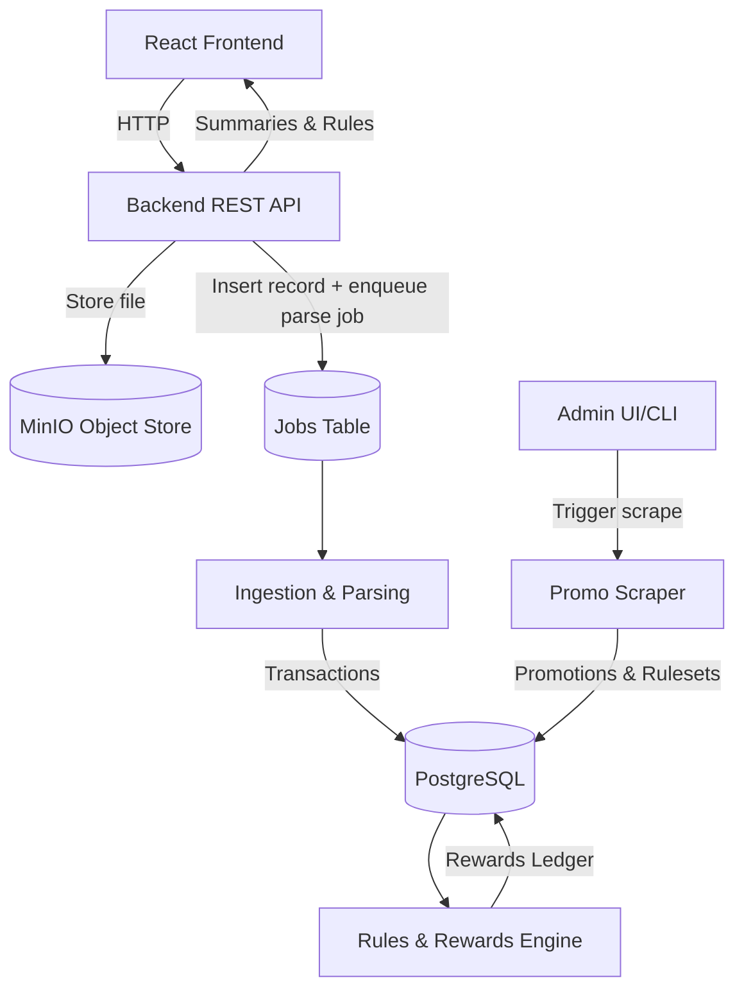

# Credit Card Rewards Tracker — Context File

## 🧭 Overview

Open-source project enabling users to:

* Specify which credit cards they own (starting with **DBS** cards).
* Upload their credit card statements (PDF/CSV).
* View how much rewards they’ve earned from which transactions.
* (Admin) Scrape and update DBS promotions and reward rules.

Initially **self-hosted**, orchestrated with **Docker Compose**.

---

## ⚙️ Architecture — Phase 1

### Stack

* **Backend:** Go (modular monolith)
* **Database:** PostgreSQL
* **Object Store:** MinIO (S3-compatible)
* **Frontend:** React + Tailwind
* **Orchestration:** Docker Compose
* **Auth:** Local JWT (user/admin)
* **Observability:** Structured logs, metrics, audit logs

### Core Modules

| Module                     | Description                                                        |
| -------------------------- | ------------------------------------------------------------------ |
| **Frontend**               | Web UI for users/admins — upload statements, browse rewards/promos |
| **API Layer**              | REST endpoints, auth, job orchestration                            |
| **Ingestion & Parsing**    | Parse uploaded statements (PDF/CSV) into normalized transactions   |
| **Rules & Rewards Engine** | Apply versioned reward rulesets to compute rewards                 |
| **Promo Scraper**          | Scrape DBS promotion pages, normalize data, propose new rulesets   |
| **Scheduler**              | Polls job table, runs parsing/evaluation/scraping jobs             |
| **Storage**                | PostgreSQL + MinIO integration                                     |
| **Auth**                   | Email/password users with JWT and roles                            |
| **Observability**          | Logging, metrics, audit tracking                                   |

---

## 🧩 System Flow



---

## 📁 Backend Structure

```
backend/
├─ cmd/server/main.go
├─ internal/
│  ├─ api/          # REST routers & handlers
│  ├─ auth/         # JWT + bcrypt
│  ├─ ingestion/    # Parsers for PDF/CSV
│  ├─ rules/        # Rules engine + DSL
│  ├─ rewards/      # Reward evaluation logic
│  ├─ scraper/      # DBS promo scraping
│  ├─ scheduler/    # Cron + job executor
│  ├─ storage/      # DB + MinIO clients
│  ├─ jobs/         # Job queue manager
│  └─ common/       # Config, logging, utils
```

---

## 🖥️ Frontend (React/Tailwind)

### Key Features

* User authentication
* Card selection
* Statement upload (PDF/CSV)
* Rewards overview & breakdown
* Promotions browser
* Admin: trigger scraping

### REST API Interactions

| Action            | Endpoint                              | Payload                   | Response               |
| ----------------- | ------------------------------------- | ------------------------- | ---------------------- |
| Upload statement  | `POST /statements`                    | multipart (file, card_id) | `statement_id`, status |
| View transactions | `GET /transactions?statement_id=x`    | —                         | list                   |
| Rewards summary   | `GET /rewards/summary?statement_id=x` | —                         | totals                 |
| Card rules        | `GET /cards/:id/rules`                | —                         | rules JSON             |
| Browse promos     | `GET /promotions`                     | —                         | promotions list        |
| Trigger scrape    | `POST /scrape`                        | —                         | job status             |

---

## 📜 Database Schema Highlights

### `statements`

Tracks uploaded statements.

```sql
CREATE TABLE statements (
  id uuid PRIMARY KEY,
  user_id uuid NOT NULL,
  card_id text NOT NULL,
  filename text NOT NULL,
  storage_path text NOT NULL,
  status text CHECK (status IN ('uploaded','parsing','parsed','failed')),
  period_start date,
  period_end date,
  uploaded_at timestamptz DEFAULT now(),
  parsed_at timestamptz,
  error_message text,
  metadata jsonb
);
```

Example path: `statements/{user_id}/{card_id}/{filename}`

---

### `rulesets` & `rewards_ledger`

Holds card reward logic and computed outcomes.

```sql
CREATE TABLE rulesets (
  id uuid PRIMARY KEY,
  card_id text,
  version text,
  json_rules jsonb,
  effective_from date,
  effective_to date
);

CREATE TABLE rewards_ledger (
  id uuid PRIMARY KEY,
  transaction_id uuid,
  ruleset_id uuid,
  points numeric,
  cashback numeric,
  reason_json jsonb,
  computed_at timestamptz
);
```

---

### Example Ruleset

```json
{
  "version": "2025-10-01",
  "card": "DBS Woman's World",
  "base_rate": 0.01,
  "multipliers": [
    { "category": "online", "mcc_include": [5732, 5699], "rate": 0.04 },
    { "category": "contactless", "mcc_exclude": [4900], "rate": 0.03 }
  ],
  "caps": { "monthly_points": 10000 }
}
```

---

### `promotions`

Scraped from DBS promotional pages.

```sql
CREATE TABLE promotions (
  id uuid PRIMARY KEY,
  bank text,
  title text,
  start_date date,
  end_date date,
  category text,
  url text,
  description text,
  status text
);
```

---

### `jobs`

Simple job queue.

```sql
CREATE TABLE jobs (
  id uuid PRIMARY KEY,
  type text,
  payload_json jsonb,
  status text,
  attempts int,
  created_at timestamptz,
  updated_at timestamptz
);
```

---

### `users` & `audit_logs`

```sql
CREATE TABLE users (
  id uuid PRIMARY KEY,
  email text UNIQUE,
  password_hash text,
  role text,
  created_at timestamptz DEFAULT now()
);

CREATE TABLE audit_logs (
  id uuid PRIMARY KEY,
  user_id uuid,
  action text,
  entity text,
  entity_id uuid,
  before jsonb,
  after jsonb,
  created_at timestamptz
);
```

---

## 🔁 End-to-End Flow

1. User uploads a statement.
2. Backend stores file in MinIO + inserts `statements` record.
3. Job `parse_statement` enqueued.
4. Parser extracts transactions, updates record.
5. Job `evaluate_rewards` triggered.
6. Rewards engine computes rewards → `rewards_ledger`.
7. User views summary.
8. Admin triggers `/scrape` → updates promotions/rules.

---

## 🐳 Deployment (Docker Compose)

```yaml
services:
  backend:
    build: ./backend
    ports: ["8080:8080"]
    env_file: .env
    depends_on: [postgres, minio]

  frontend:
    build: ./frontend
    ports: ["3000:80"]
    depends_on: [backend]

  postgres:
    image: postgres:16
    environment:
      POSTGRES_USER: cc_rewards
      POSTGRES_PASSWORD: cc_rewards
      POSTGRES_DB: cc_rewards
    volumes: [db_data:/var/lib/postgresql/data]

  minio:
    image: minio/minio
    command: server /data
    environment:
      MINIO_ROOT_USER: minioadmin
      MINIO_ROOT_PASSWORD: minioadmin
    ports: ["9000:9000"]
    volumes: [minio_data:/data]

volumes:
  db_data:
  minio_data:
```

---

## 🧱 Phase 1 Deliverables

* Self-hosted MVP via Docker Compose.
* DBS-only support (initially).
* Statement upload, parsing, rewards computation.
* Promo scraping + rule versioning.
* Complete audit and job tracking.
* Deterministic reprocessing through MinIO-backed artifacts.

---

